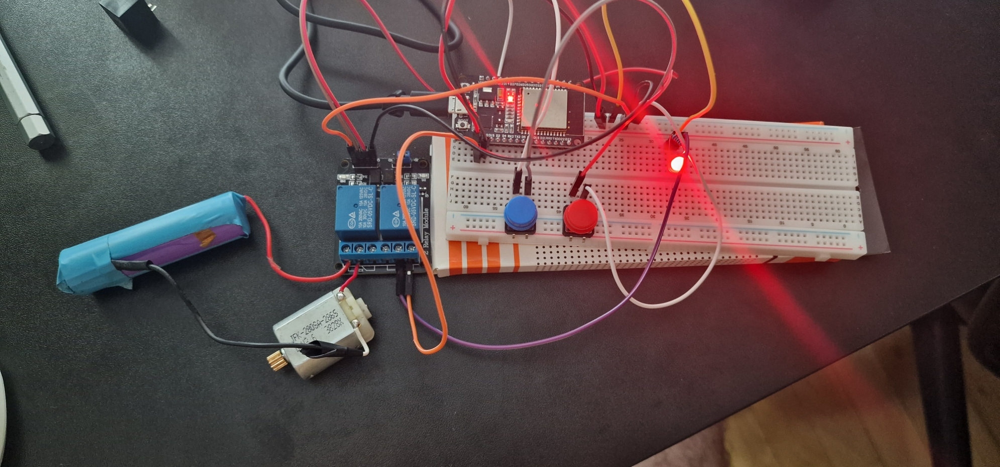
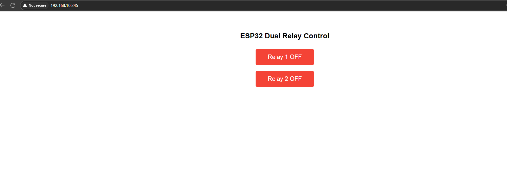

# ESP32 Dual Relay Web Server

Control two relays with an ESP32 via physical buttons and a web interface. The project supports toggling relays with hardware buttons or through a mobile-friendly web UI showing real-time relay status.

---
## Wired ESP32

## WebServer ESP32

---
## Hardware

- **ESP32 Development Board**  
- **HL-52S Dual Relay Module (3.3V compatible)**  
- 2 x Push Buttons (normally open)  
- LEDs (optional, for testing relay outputs)  
- Jumper wires, breadboard, power supply

### Wiring

| ESP32 Pin   | Relay Module Pin | Description          |
|-------------|------------------|----------------------|
| GPIO 26     | IN1              | Relay 1 control      |
| GPIO 27     | IN2              | Relay 2 control      |
| GPIO 14     | Button 1         | Push button 1 input  |
| GPIO 12     | Button 2         | Push button 2 input  |
| GND         | GND              | Common ground        |
| 3.3V        | VCC (relay VCC)  | Relay power supply   |

**Notes:**  
- Buttons connected between GPIO pins and GND, with internal pull-up enabled.  
- Relay module requires 3.3V power supply (check your relay specs).  
- Relay logic: **LOW activates relay**, **HIGH deactivates relay**.

---

## Software

### Features

- Toggle relays via physical buttons or web UI buttons.  
- Web UI reflects real-time relay status with color-coded buttons.  
- WiFi connection setup with your SSID and password.  
- Debounce logic for stable button reading.

### How to use

1. Clone or copy the Arduino sketch.  
2. Modify WiFi credentials in the sketch (`ssid` and `password`).  
3. Upload the sketch to your ESP32.  
4. Open the Serial Monitor (115200 baud) to see IP address once connected.  
5. Connect your browser to the ESP32 IP address.  
6. Use the buttons on the web page or physical push buttons to toggle relays.

---

## Troubleshooting

- **Relay does not switch:**  
  - Verify wiring and power to the relay board.  
  - Ensure IN pins are connected to correct ESP32 GPIOs.  
  - Check the relay module voltage requirements (3.3V for HL-52S).  
  - Test relays manually by grounding IN pins to confirm functionality.  

- **Button presses not detected:**  
  - Check wiring of buttons to GPIO and GND.  
  - Confirm `INPUT_PULLUP` mode is set on button pins.  
  - Try shorting button pin to GND to simulate press.  

- **Relay unstable / toggles on touch:**  
  - Inspect and re-solder relay module connections.  
  - Try changing ESP32 GPIO pins controlling the relay.  
  - Add small decoupling capacitor (0.1µF) between IN and GND to filter noise.  
  - Consider relay module quality and replace if faulty.

---

## Code Overview

- **`setup()`**: Initializes pins, WiFi connection, and web server routes.  
- **`loop()`**: Handles web requests and button input logic with debounce.  
- **Web server endpoints:**  
  - `/` serves the control UI page.  
  - `/toggle?relay=1` toggles relay 1; `/toggle?relay=2` toggles relay 2.  
  - `/state` returns current relay states as JSON.

---

## License

This project is open source and free to use.

---

